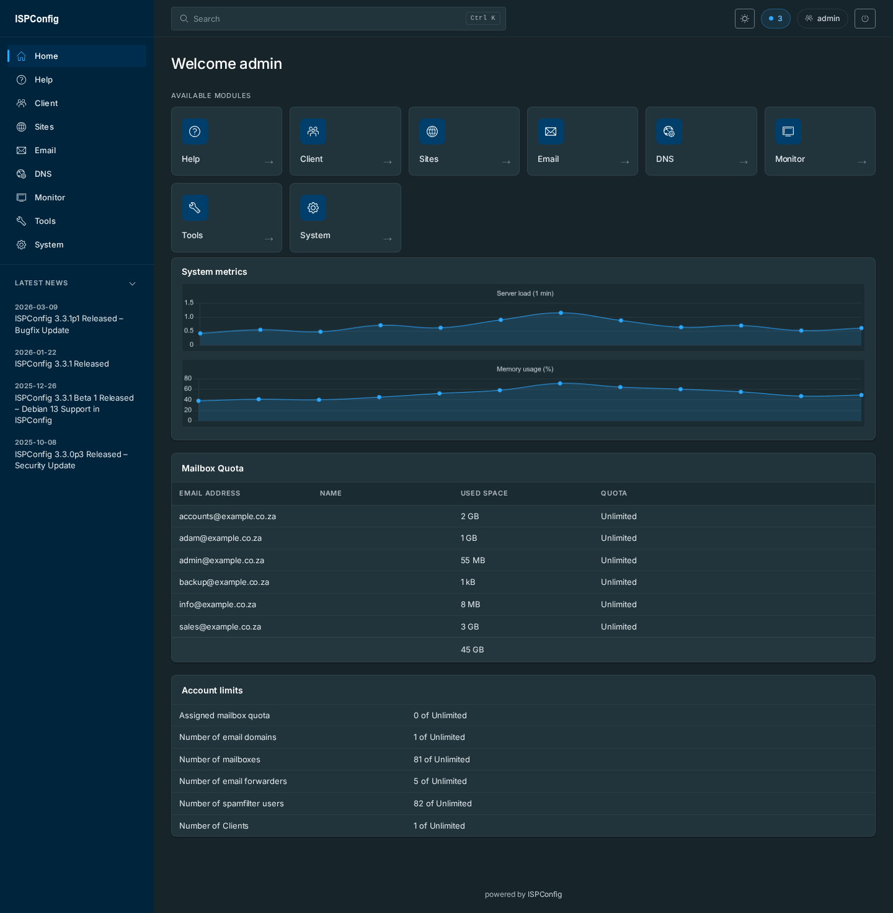
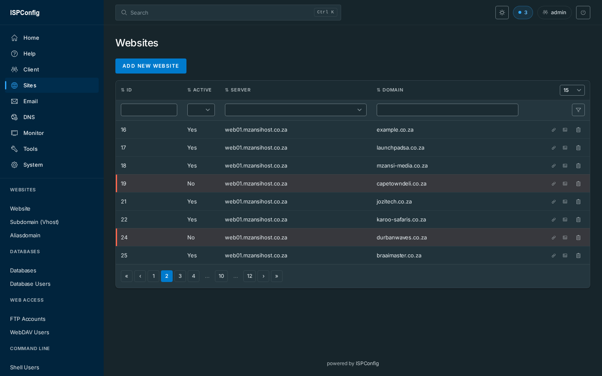
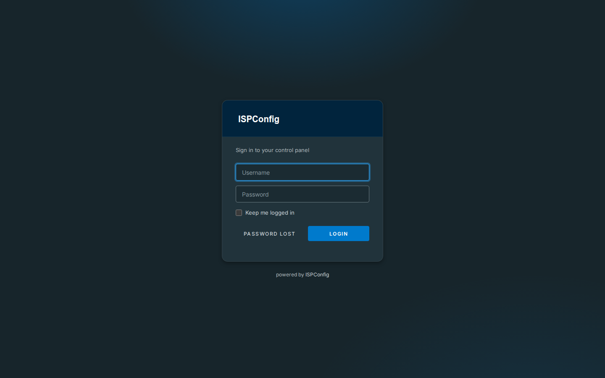

# Clarity Theme for ISPConfig — a dark theme for ISPConfig

A complete, modern interface for the [ISPConfig](https://www.ispconfig.org/)
control panel, built on **VMware Clarity** dark design tokens: navy
navigation rail, card-based content, Clarity icons throughout, a
**dark/light switcher**, and a redesigned login screen. Installed as a
normal ISPConfig theme — **no core file is ever modified**, so it survives
panel updates.



| | |
|---|---|
|  |  |

## Requirements

- ISPConfig **3.3** (built and verified against 3.3.1p1; 3.2 may work but is
  untested)
- Root shell access to the panel server
- The stock `default` theme still present (it always is — Clarity Theme for ISPConfig loads
  its vendor CSS/JS from there)

## Install

```bash
cd /opt                                  # somewhere the web server can read — NOT /root
git clone https://github.com/wadejbeckett/clarity-theme-ispconfig.git
cd clarity-theme-ispconfig
./install.sh /usr/local/ispconfig        # your ISPConfig root, if different
```

That's it. The installer symlinks the theme into
`interface/web/themes/clarity` and stamps the version-gate files ISPConfig
requires. Because it's a symlink, the panel reads the theme **from your
clone** — so the clone (and every parent directory) must be readable by the
web server; `/root` is not, which is why the example uses `/opt`. Use
`./install.sh --copy` instead if you prefer real files over a symlink (then
the clone can live anywhere, and needn't stay on the server).

Multiserver setups: install only on the server that serves the ISPConfig web
interface (the master/panel server) — slave servers need nothing.

**Then switch your user to it:** log into the panel → *Tools → User
Settings → Design → `clarity` → Save* → **log out and back in** (ISPConfig
applies the theme at login), and hard-refresh the browser (`Ctrl+Shift+R`).

**Login screen + system-wide default (optional):** set

```php
$conf['theme'] = 'clarity';
```

in **both** `interface/lib/config.inc.php` **and** `server/lib/config.inc.php`
(each has the line, default `'default'`). The interface one takes effect
immediately and controls the login page plus the default for new users. The
server one is what makes it stick: ISPConfig updates regenerate both config
files and carry the theme value forward from the **server** config — set only
the interface one and the login screen quietly reverts at the next panel
update.

## After an ISPConfig upgrade

ISPConfig silently reverts users to the `default` theme unless the theme's
`ispconfig_version` file exactly matches the new panel version. So after any
panel upgrade:

```bash
cd clarity-theme-ispconfig && ./install.sh /usr/local/ispconfig
```

(re-stamps the version files; on a **major** upgrade also check
`themes/clarity/BUILT-AGAINST.txt` — it lists the three templates to re-diff
against stock.)

If you installed with `--copy`, re-clone anywhere and re-run **with `--copy`
again** — re-running without it converts your install into a symlink pointing
at the new clone.

## Uninstall

```bash
rm -rf /usr/local/ispconfig/interface/web/themes/clarity
```

Users who had it selected are automatically reset to the default theme at
their next login. If you set `$conf['theme'] = 'clarity'` in the config
files, change it back to `'default'` in both.

## Troubleshooting

| Symptom | Cause / fix |
|---|---|
| Theme not in the Design dropdown | Version stamp missing or stale — re-run `./install.sh`. |
| Selected it, but panel still looks stock | Log out and back in; then hard-refresh (`Ctrl+Shift+R`). |
| Reverted to default after a panel upgrade | Expected — re-run `./install.sh` (see above). |
| Login screen / system default reverted after a panel upgrade | You set `$conf['theme']` only in `interface/lib/config.inc.php` — updates regenerate it. Set it in `server/lib/config.inc.php` too (see Install). |
| Unstyled/white page | For symlink installs: the clone and **every parent directory** must be readable/traversable by the panel's web server — a clone under `/root` serves nothing. Move it (e.g. `/opt`) or reinstall with `--copy`. Also check `themes/default` still exists (vendor assets load from it). |

## White-labeling

The theme ships with neutral **ISPConfig** default branding — no third-party
marks — so it's ready to use as-is or to brand for any organisation. Two
single-touch swaps are all it takes, no CSS or template edits:

- **Wordmark** — replace `themes/clarity/assets/images/wordmark-white.svg`
  with your own logo (white/light artwork — it sits on the navy brand band in
  the sidebar, mobile header, and login card). Any aspect ratio works.
- **Favicons** — drop your own set into `themes/clarity/assets/favicon/`.

## Repo layout

| Path | What |
|---|---|
| `themes/clarity/` | The theme: 3 templates + 6 stylesheets + fonts/brand assets. |
| `themes/clarity/BUILT-AGAINST.txt` | Exactly what is overridden and why it's upgrade-safe. |
| `install.sh` | Installer (symlink or copy + version stamping). |
| `DESIGN.md` | The design language — tokens, surfaces, component rules. |
| `mockup/` | Offline dev harness: renders the real templates with sample content and screenshots them (`python3 build.py --shoot`, needs Playwright **and** a local ISPConfig source checkout at `.refs/ispconfig3/` for the stock vendor assets). Not needed to install. |

## Contributing

Bug reports, fixes, and ideas are welcome — see
[CONTRIBUTING.md](CONTRIBUTING.md) for how the theme is put together, the
ground rules that keep it update-proof, and how to test a change. Use the
issue templates; they ask for exactly what makes a theme bug diagnosable.

## Support this project

Clarity Theme for ISPConfig is free and MIT-licensed. If it saves you time and you'd like to
say thanks, donations are taken in Monero:

```text
44BtMn9izxH8mK2yFbSdY6Di7TNobkLbnHdZ6gZQjukCME5vsNhtPRtH4TcVkDHKHLhSpAJbsjv8gCdYuSZVMpXgMkUC1hV
```

Code is just as welcome as coin — see [Contributing](#contributing) above.

### Support ISPConfig itself

This theme only exists because [ISPConfig](https://www.ispconfig.org/) does.
The project takes no direct donations; the way its developers ask to be
supported is:

- **Buy the [ISPConfig manual](https://www.ispconfig.org/documentation/user-manual/)** (€5) or a
  [HowtoForge subscription](https://www.howtoforge.com/download-the-ispconfig-3-manual)
  that includes it — the project's own README names this as the way to fund
  development.
- Need paid help? [ISPConfig Business Support](https://www.ispconfig.org/get-support/)
  is run by the core team's official partner.
- Their commercial tools fund the free panel:
  [ISPProtect](https://www.ispprotect.com/) (malware scanning) and the
  [Migration Tool](https://www.ispconfig.org/add-ons/ispconfig-migration-tool/)
  (imports from Plesk/cPanel/Confixx and older ISPConfig).
- Contribute upstream: code and bug reports at
  [git.ispconfig.org](https://git.ispconfig.org/ispconfig/ispconfig3), help
  other users at the [HowtoForge forum](https://forum.howtoforge.com/).

## Licensing

- Theme: [MIT](LICENSE).
- Surface/status values derived from VMware **Clarity** (`@cds/core`, MIT);
  frame anatomy informed by DirectAdmin Evolution (reference only, nothing copied).
- **Inter** font — [SIL OFL 1.1](themes/clarity/assets/fonts/inter/LICENSE.txt), self-hosted.
- ISPConfig is BSD-licensed; this theme ships no ISPConfig code and modifies none.

### Notices

- Not affiliated with, or endorsed by, VMware. This theme is built using the
  open-source Clarity design system tokens (`@cds/core`, MIT).
- Not affiliated with, or endorsed by, the ISPConfig project. ISPConfig is a
  trademark of its respective owner; this is an independent, third-party theme.

---

Maintained by [Wade Beckett](https://github.com/wadejbeckett) as an independent,
open-source project — contributions welcome from anyone.

Part of the [ISPConfig Toolkit](https://github.com/wadejbeckett/ispconfig-toolkit) —
a growing collection of ISPConfig modules and tools.
